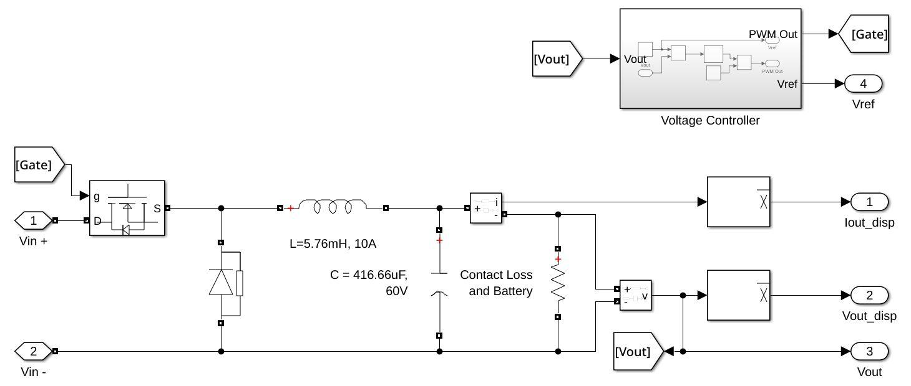
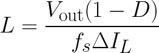
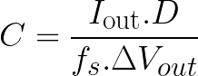
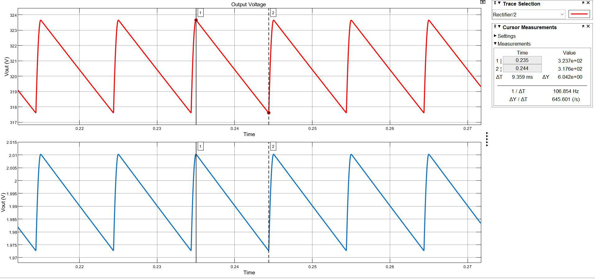
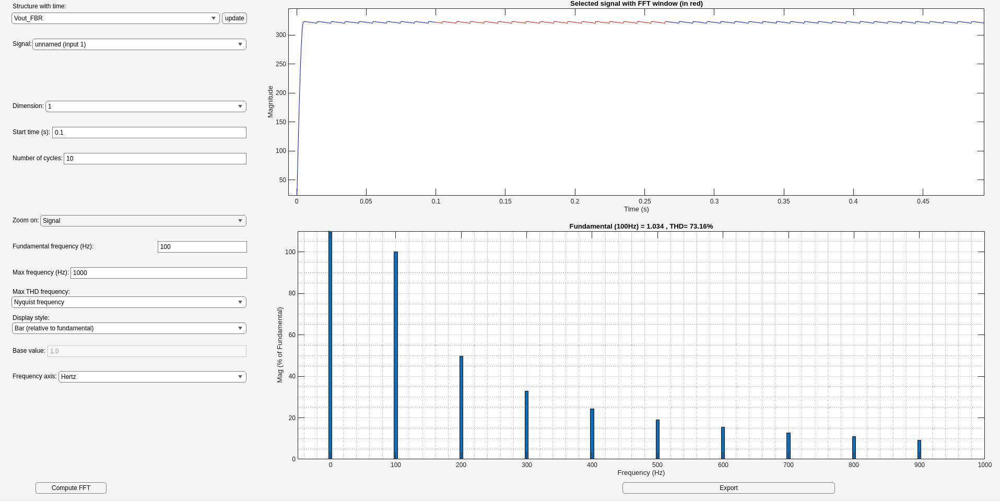
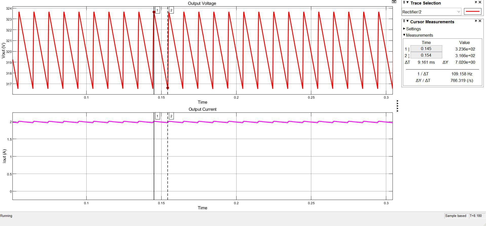
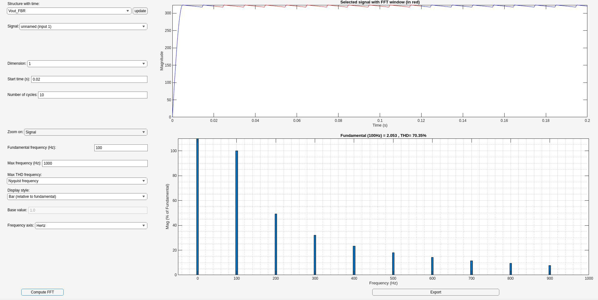
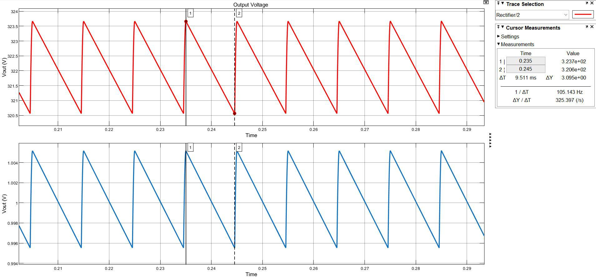
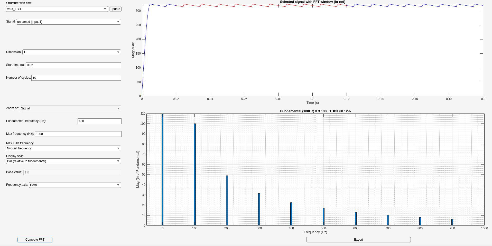

<h2 align="center" style="font-weight: normal;">EV MASTER CLASS CAPSTONE PROJECT</h2>
<h1 align="center">Simulation of On-Board Charger for E-Bike Application</h1>

## eBike Onboard Charger Design - Assumptions

The following parameters were selected to ensure compatibility, and efficiency for typical eBike battery requirements.

## Design Assumptions

The onboard charger was designed with the following key parameters:

### 1. Input Voltage (Vin): 110-240V AC
   - **Range:** The charger is compatible with standard AC wall outlets across a wide voltage range, from 110V to 240V.

### 2. Output Voltage (Vout): 48V DC
   - **Battery Compatibility:** The 48V DC output is tailored to match the standard voltage requirements for most eBike battery packs.
   - **Stable Output:** This voltage ensures the charger delivers a steady DC output compatible with the onboard battery management system (BMS).

### 3. Output Current (Iout): 5A
   - **Safe Charging Rate:** An output current of 5A is optimized to charge eBike batteries effectively without overheating or overloading the cells.
   - **Extended Battery Life:** This moderate current level minimizes stress on battery cells, supporting longer battery life by reducing the risk of overcurrent.

### 4. Output Power: 240W
   - **Efficient Power Delivery:** With a total output power of 240W, the charger provides sufficient power for timely charging of most eBike battery sizes.

### 5. Charging Efficiency: >90%
   - **Energy Efficiency:** The charger is designed to achieve an efficiency of greater than 90%, ensuring that most of the power drawn from the AC source is effectively transferred to the battery.
   - **Reduced Heat Generation:** High efficiency minimizes power losses, leading to less heat generation during operation, which is crucial for maintaining safe temperatures in compact eBike chargers.

## Buck Converter Explanation

## Overview
A Buck Converter is a type of DC-DC converter that steps down a higher input voltage (Vin) to a lower output voltage (Vout) by switching a transistor (MOSFET) on and off at high frequency (10kHz). This circuit is controlled by a **PWM (Pulse Width Modulation)** signal that adjusts the output voltage based on the desired reference voltage (Vref).

## Components and Operation

### 1. Input Voltage (Vin)
The input voltage source (Vin) provides the initial DC power to the Buck converter. This voltage is typically higher than the required output voltage.

### 2. Switching MOSFET
The MOSFET acts as a high-speed electronic switch controlled by a **PWM signal**. The switching operation determines the duty cycle of the output, which in turn controls the average output voltage. When the MOSFET is turned on (closed), current flows through the inductor to the load. When it’s off (open), the inductor maintains the current flow by releasing its stored energy.

In this Buck Converter, the MOSFET is switched at a frequency of **10 kHz**. The switching frequency is chosen based on a balance between efficiency, component size, and heat dissipation. Here’s why 10 kHz is a suitable choice:

1. **Efficiency vs. Switching Losses**:
   - Higher switching frequencies improve the output voltage ripple and dynamic response but also increase switching losses in the MOSFET.
   - At 10 kHz, switching losses are kept relatively low, helping to maintain high overall efficiency without excessive heat generation in the MOSFET.

2. **Component Sizing**:
   - Inductors and capacitors can be smaller at higher switching frequencies because the ripple current and voltage decrease as frequency increases.
   - However, very high frequencies (e.g., above 100 kHz) require expensive high-speed MOSFETs and may lead to electromagnetic interference (EMI) issues.
   - A frequency of 10 kHz allows for a reasonable component size while balancing performance and cost.

### 3. Diode
The diode provides a path for the inductor current when the MOSFET is off, preventing reverse current. This configuration helps maintain a steady current flow to the load.

### 4. Inductor (L = 5.76mH, 10A)
The inductor stores energy when the MOSFET is ON and releases it when the MOSFET is OFF. It smooths the current flow to reduce ripple, making the output current more stable. The inductance value here is 5.76 mH, and allows it to handle a maximum current of 10 A.
## Inductance Value Selection in the Buck Converter

The inductance value (L) in a Buck Converter is chosen to limit the ripple current (ΔI_L) through the inductor. Controlling this current ripple helps improve efficiency, reduce stress on components, and maintain a stable output current. In this converter, the inductance value is calculated to keep ΔI_L within 10% of the output current.

### Formula for Inductance
The inductance value, L, can be calculated with the formula:

where:
- V_out is the output voltage,
- D is the duty cycle,
- f_s is the switching frequency (10 kHz in this case),
- ΔI_L is the peak-to-peak ripple current through the inductor.

### Calculation of Inductance

- V_out = 48 V,
- f_s = 10 kHz,
- ΔI_L = 10% of 5A = 0.5A,
- D is set by the PI controller.
- After substituting the values, we get the inductance to be 5.76mH.
- Current rating of 10A is choose so that it can handle transients.

### 5. Capacitor (C = 416.66uF, 60V)
The capacitor at the output helps to further smooth the output voltage by reducing ripple. This filter capacitor is crucial for maintaining a steady DC output. Its capacitance is 416.66 µF, rated for 60 V.
## Capacitance Value Selection in the Buck Converter

The capacitance value (C) in a Buck Converter is chosen to limit the ripple voltage (ΔV_out) across the output capacitor. Controlling this voltage ripple helps maintain a stable output voltage and reduce noise, ensuring reliable operation of the load. In this converter, the capacitance value is calculated to keep ΔV_out within an acceptable range, typically within 1-2% of the output voltage.

### Formula for Capacitance
The capacitance value, C, can be calculated with the formula:

where:
- I_out is the output current,
- D is the duty cycle,
- f_s is the switching frequency (10 kHz in this case),
- ΔV_out is the peak-to-peak ripple voltage at the output.

### Calculation of Capacitance

- V_out = 48 V,
- I_out = 5 A,
- f_s = 10 kHz,
- ΔV_out = 1% of 48 V = 0.48 V,
- D is set by the PI controller.
  
After substituting the values, capacitance comes out to be 416.66uF.

### 6. Contact Loss and Battery
This block represents the connection to the load, including any contact resistance or battery characteristics. Contact loss simulates any additional resistance or drop caused by imperfect contacts, which may affect the efficiency of power transfer.

### 7. Voltage Controller
The **Voltage Controller** block compares the output voltage (Vout) with the reference voltage (V_ref) and adjusts the PWM signal sent to the MOSFET gate to regulate the output. This feedback loop helps maintain a steady output voltage regardless of input or load variations.

### 8. Output Voltage (Vout)
The output voltage (Vout) is the regulated, stepped-down voltage delivered to the load. It’s continuously monitored by the Voltage Controller to ensure it remains close to V_ref.

## Results
The Full Bridge Rectifier's output with 1A load yeilded ripple of 3.395V and the expected ripple was supposed to be 3.25V.

with TDR

The Full Bridge Rectifier's output with 2A load yeilded ripple of 3.395V and the expected ripple was supposed to be 7.02V.

with TDR

Since the load resistance is decreased, the capacitor discharges very fast between the pulsating rectified voltage peaks. This fast discharging causes a bigger percentage to drop in the output voltage during the intervals between the peaks of the rectified voltage. Thus it increases ripple voltage.

When the capacitance values was increased, the ripples were below 1%.

with TDR

